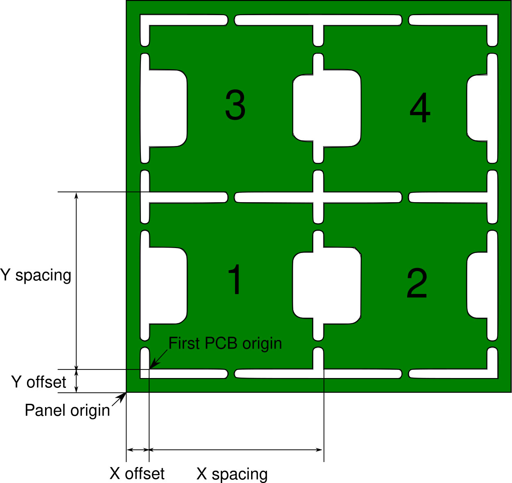

# KiCad to CHMT36VA conversion script

This script is used to convert KiCad component position files *.pos into CharmHigh pick and place *.dpv files.

Feeder information is loaded from a local spreadsheet file, using the same syntax as SparkFun's online sheet.

## Prerequisites
The script uses Python 3. 

The following dependencies are needed : 
* `pyexcel`
* `pyexcel-odsr` for ods, fods files support
* `pyexcel-xls` for xls, xlsx files support (untested)

You can run `pip3 install pyexcel pyexcel-odsr` to install those dependencies.

## Usage
Run `python3 convert.py -h` to get an overview of the command line options.

### KiCad export
As of KiCad v5.1.0 : 

Remember to set the auxiliary axis origin at the bottom left of the PCB, so that all the components positions are related to the PCB corner.

Export the *.pos files using File > Fabrication outputs > Footprint Position (.pos) File.

Choose the following options : ASCII / Millimeters / Separate files from front and back.

### Feeder data
You can find a sample file in this repository : `feeders_data_sample.fods`. This is basically the same file as Sparkfun's online spreadsheet, kept as a local copy here in case the online version is changed in the future.

You can get detailed usage information here : https://www.sparkfun.com/sparkx/blog/2591

### Basic usage
Let's have a look at the most basic usage : a single PCB with components on the top side only. 

You just have to run the script specifying your .pos file path and your feeder data file path : 

    python3 convert.py PROJECT-top.pos FEEDER_DATA.ods

The following file formats are supported for the feeder data file : csv, ods/fods, xls/xlsx. You may have to install extra pyexcel packages to support all of these formats.

If everything went well you will get a recap indicating which feeders are used, which components will be placed, etc.

If the pos file has footprints whose designator starts with FID, these will be detected as fiducials and inserted into the dpv file. If the data is not correct you can still set the calibration data manually from the CharmHigh software.

#### Unassigned components
There is a command line option to include the components that were not found in the feeders list in the dpv file. You can then assign them later from the Charmhigh software if needed. By default, they are assigned to head 1 and feeder 99 because the Charmhigh software complains with a "file error" when trying to run the job if these values are outside the expected range.

### Bottom components
When a PCB has components on the bottom, the component coordinates must be mirrored and the origin should be the bottom right corner (when viewed from the top).

Two extra arguments must be specified : `--mirror_x` tells the script to flip all components (and their rotations) while `--board_width` provides the required offset in mm. 

    python3 convert.py PROJECT-top.pos FEEDER_DATA.ods --mirror_x --board_width W

### Populating a panel
This is not supported directly by this script and should be set manually from the CharmHigh software.

However one important step is to specify the offset of the bottom left PCB in the panel. 

You should export the .pos file from the single PCB file (not the panel). From the panel, you need the following data : X and Y offset, X and Y spacing. 

Then run the script as usual, specifying the X and Y offset : 

    python3 convert.py PROJECT-top.pos FEEDER_DATA.ods --offset X Y

From the Charmhigh software, under the "Batch" tab, you can now switch to "Array" mode and set the number of PCBs in either direction and the spacing.

You will have to provide the panel fiducials coordinates in the "PCB calibrate" tab (or you can calibrate on the first PCB but it won't be as precise).

If one of the PCBs on the panel is defective, you can add a "Skip" record to disable it. The numbering scheme is drawn on the previous drawing.

### Bottom components on a panel
This is the same as for the top components, except that you should measure the offset while looking at the board from the bottom. You can do this easily using the View > Flip board view command that is present in the last KiCad versions.

You should run: 

    python3 convert.py PROJECT-top.pos FEEDER_DATA.ods --mirror_x --board_width W --offset X Y

with W the width of a **single PCB** ; X and Y the offset from the flipped view.