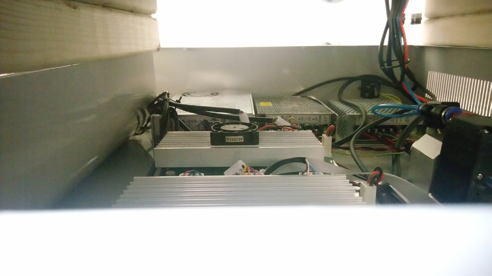
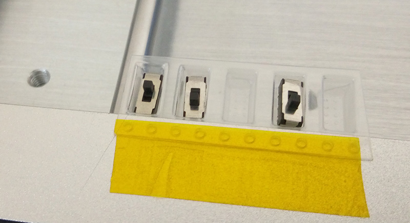
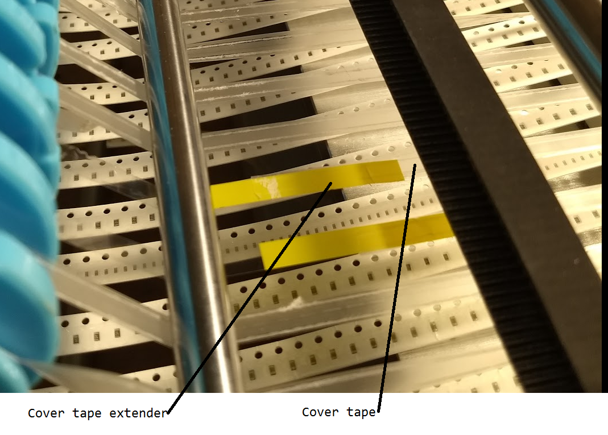

Charm High Desktop Pick and Place - Tips and Tricks
========================================

Here are some of the lessons learned. Be sure to sign up for the [Desktop Pick and Place](https://groups.google.com/d/forum/desktop-pick-and-place) google group for the latest!

Disassembly
-----------

The following photos were taken when adding the ON/OFF button. They were taken with a phone camera (sorry).

### Access via Top Plate

You can lift the top plate off, which provides access to the entire internals of the machine. To do so:

1. Remove all the hex screws from the top-side. You can move the head around to access various bolts.
2. Lift the top plate. Note you don't have to take anything OFF the top plate, but you will have all the cables still going through that top aluminum plate. Thus the easiest (only?) way is to use 2x3s or 2x4s as "stand-offs" to provide you with some working room and simply hold the top plate up a little bit.

The following shows an example of that (note 2x3's holding plate up):

Note you can also remove the front panel which has some good access holes.

### Access via Front Panel

The front panel is a piece of aluminum held on with 6x screws. These screws are underneath of a printed plastic panel that is glued on - you have no real choice but to peel this front panel back. You can then remove the screws, and there is some nice holes in the front side (they  would hold the LCD for the other model with an integrated LCD) that can be helpful to work through.

Adding Saftey Switch
--------------------

The e-stop button is software-based, so you might want something that you *KNOW* will kill the motors. Not so much for E-Stop purposes, but so you could reach into the machine safely without worry (i.e., when loading tapes), but without screwing up the communications protocol too badly that might happen if I switched the entire system off.

I wired in a DPDT switch to cut each of the power supplies to the stepper motor board.

When turning the switch back ON sometimes the motors shift a tiny bit, and you need to re-run the origin set task. This can easily be done by hitting the E-Stop button, which will pop up a window asking you to do this.

### Part Numbers ###

To wire the DPDT I used these parts:
* WM9127-ND to mate to the power supply connection.
* WM4999-ND (housing) + WM18820CT-ND (pins) to mate with the PCB.

To kill both boards you'll need 2x of each (+4x pins, recommend extra in case you screw up).

For the switch itself I used a fancy ABB switch which had a light in it so I could see if power was on or off. Note due to capacitors in driver boards it takes a bit for light to actually go off.

I also used a 28V LED (running at 36V, seems to work OK), 350-2151-ND.

Deeper Cut Tapes
----------------

The tape & reel feeders on this thing do not work well with deeper parts. They work great with resistors/capacitors or anything with constant depth.

Something like a SMD switch is no-go though, it won't even feed through the metal holder. Instead I found you could tape a strip to the frame, and set it up as an "IC Tray" with a single row:

You could probably make a nice fancy holder for this too, but this worked well enough for me as a test.

Maximum Part Height
-------------------

The maximum part height by the specs is 5mm. This is pretty accurate - you could use my "cut tape hack" from above to pickup deeper parts, but they will possibly hit stuff as the head is moving around, and when it tries to place them down it screws up the head.

You can "probably" get it to work with deeper parts, but I recommend just avoiding them if possible.

Cover-Tape Doesn't Peel Off
---------------------------

The cover-tape sometimes doesn't peel off. This causes the device to not pickup parts, and almost always requires you to have vision enabled so it can detect this.

If everything otherwise seems OK (i.e., not snagged on anything) you can use a small hex driver to tighten the screw on the cover-tape take-up reel, which seems to improve the grip as it may be too lose. Turn it a small amount (1/8-turn to maybe 1/4 a turn) at a time.

Parts turn upright
------------------

Small parts may turn up-right. If you don't program parts size this won't be detected. Anyway this is often caused as the pick-up location is a tiny bit off, so double-check the pickup location.

Loading Cut Tape
----------------

It's worth buying a box of cover tape extenders (the tape that comes on reels). Search "SMT cover extender" on aliexpress. This way you don't have to waste many parts getting stuff fed. The cover tape extenders are reusable so a box of 500 will last a long time.

Part number 1108C (8mm) worked well for most uses.

Camera Calibration Procedure
----------------------------

Procedure for setting down and up camera visual calibration.

Discussion: https://groups.google.com/forum/#!topic/desktop-pick-and-place/8cd_NNXNBVU

1. go into diagnostics, turn on the down camera light.

2. exit diagnostics.
3. go into Settings, System Set, enter password 20090318.
4. press visual calibrate
5. press 'down', camera shows down-camera view, write down rfactor for down-camera.
6. press 'up', camera shows up-camera view write down rfactor for up-camera.
7. press calibrate, head moves over up camera.
8. find a large square part that is easy to measure with calipers. e.g. 5x5m QFN or larger.
9. measure the part in millimeters (mm)
10. place large part on nozzle, pins down.
11. adjust threshold so that bounding box highlights the part.
12. press 'R size X' enter the X measurement of the part in mm.
13. press 'R size Y' enter the Y measurement of the part in mm.
14. press 'Update' to re-calculate the 'R-Factor' for the up-camera based on the bounding box of the part and the actual component size.
15. press 'down', camera shows down camera view.
16. get a white piece of paper and place it over the down camera.
17. place the part on the piece of paper, PINS DOWN still, center it the view.
18. adjust threshold so that bounding box highlights the part.
19. press 'R size X' enter the X measurement of the part in mm.
20. press 'R size Y' enter the Y measurement of the part in mm.
21. press 'Update' to re-calculate the 'R-Factor' for the down-camera based on the bounding box of the part and the actual component size.
22. press back
23. press save.

For reference settings from Dominic Clifton's CHMT48VB are as follows:
* down camera threshold is 135 with an rfactor of 0.042383

* up camera threshold 110 with an rfactor of 0.42356

as supplied the camera was out of focus so the thresholds required adjustment once the focus was fixes.

